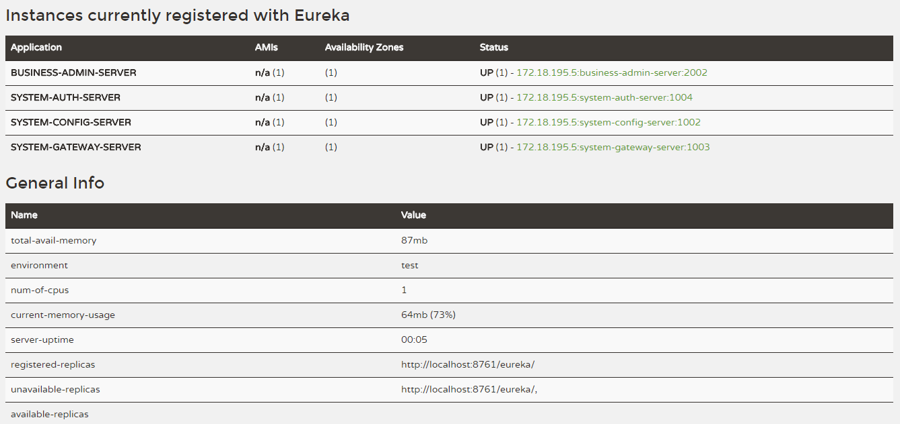
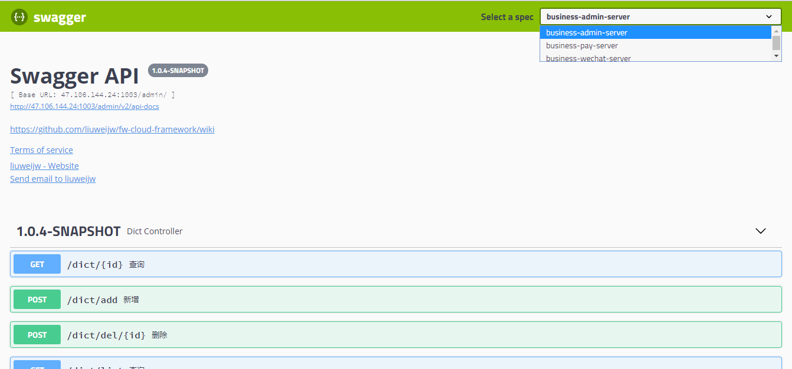
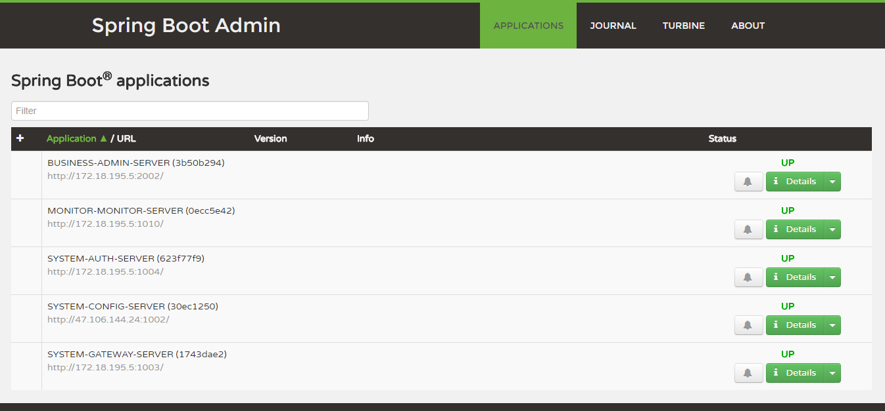
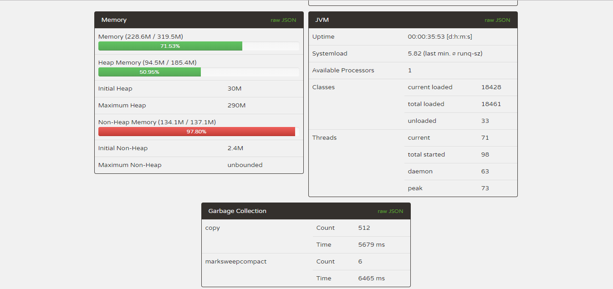
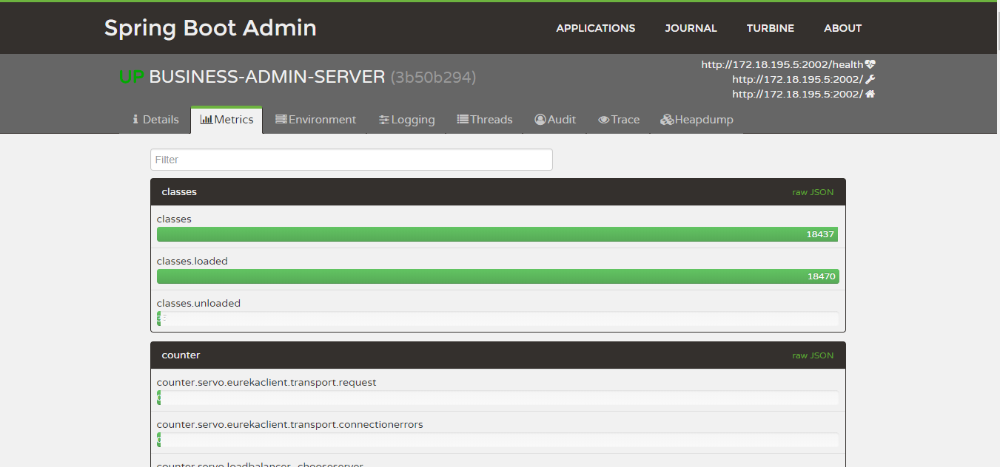
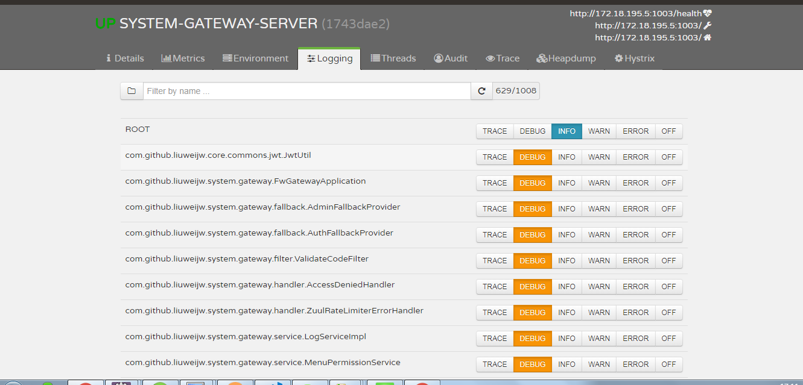
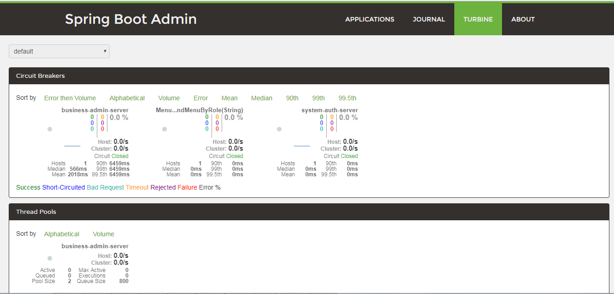
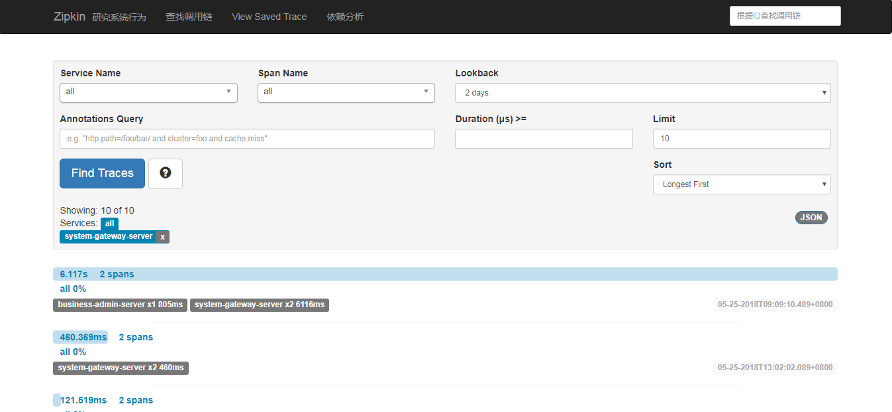
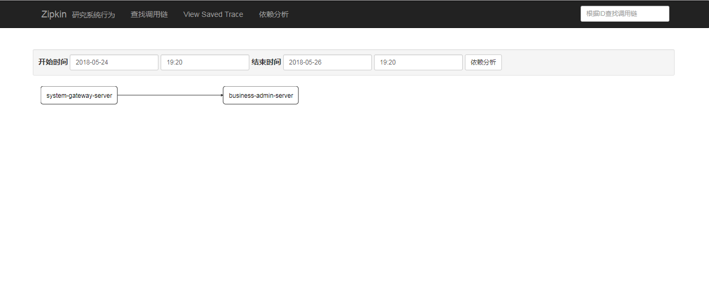

 

 
 
 
 

 

# fw-cloud-framework
基于springcloud全家桶开发分布式框架（支持oauth2认证授权、统一下单、公众号服务、Shardingdbc分库分表、常见服务监控、链路监控、异步日志、redis缓存等功能），实现基于Vue全家桶等前后端分离项目工程。[其它说明](https://github.com/liuweijw/fw-cloud-framework/wiki)

# 项目特点
* 框架方面独立、模块相互之间非常独立(feign api 独立工程，方便调用)，第三方工程服务能够轻松接入
* 服务通过网关统一接入，鉴权（网关和业务模块权限独立分开）、监控、日志、缓存等统计分析更加清晰
* 采用分布式模式，部署方便，易于扩展
* 统一下单服务接入（目前只支持微信、后续扩展支付宝等渠道）
* 微信公众号服务接入(服务提供多公众号配置、多子项目调用、公众号相关接口等)
* 采用分布式模式，[docker部署](https://github.com/liuweijw/fw-cloud-framework/wiki/08-Docker-%E9%83%A8%E7%BD%B2%E7%AE%80%E6%B4%81%E8%AF%B4%E6%98%8E)方便，易于扩展
* 前端可以基于element ui 、Vue全家桶、React 等主流，实现前后端分离

# 技术模块相关说明
1、 fw-cloud-system 模块
- fw-cloud-system-eureka  [端口1001] 服务注册中心[在线访问](http://47.106.144.24:1001/)
- fw-cloud-system-config  [端口1002] 服务配置和发现[远程配置 guide](https://github.com/liuweijw/fw-cloud-framework/wiki/02-%E9%83%A8%E5%88%86%E6%8A%80%E6%9C%AF%E9%85%8D%E7%BD%AE%E8%AF%B4%E6%98%8E)
- fw-cloud-system-gateway [端口1003] zuul服务网关（外部接口接入入口）
- fw-cloud-system-auth    [端口1004] 权限接入服务(支持oauth2、单点登录) [查看详情 guide](https://github.com/liuweijw/fw-cloud-framework/wiki/05-Auth-%E6%A8%A1%E5%9D%97%E5%90%AF%E5%8A%A8%E8%AF%B4%E6%98%8E)

2、fw-cloud-core 基础公共模块
- cloud-commons 抽离底层基础部分依赖 [guide](https://github.com/liuweijw/cloud-commons.git)
- fw-cloud-core-beans 常用全局bean
- fw-cloud-core-commons 常量、切面等
- fw-cloud-core-configuration 基础配置
- fw-cloud-core-exception Exception定义
- fw-cloud-core-utils 常用工具类

3、fw-cloud-business 业务模块服务模块
- fw-cloud-business-commons business各业务公共组件等
- fw-cloud-business-admin   [端口2002] 权限管理等接口服务
- fw-cloud-business-sso     [端口3001] 单点登录模块接入demo
- fw-cloud-business-pay     [端口2003] 微信等支付统一下单模块服务
- fw-cloud-business-pay-demo [端口待定] 微信、支付宝等支付相关demo待开发
- fw-cloud-business-wechat  [端口2004] 微信公众号模块服务
- fw-cloud-business-wechat-demo [端口待定] 微信公众号相关demo待开发

4、fw-cloud-api 抽离feign api供其它工程调用
- fw-cloud-system-api admin工程相关的feign api

5、系统监控模块
- fw-cloud-monitor-monitor    [端口1010] 服务状态监控[服务在线访问](http://47.106.144.24:1010/)
- fw-cloud-monitor-zipkin-db  [端口1011] 数据库db监控[服务在线访问](http://47.106.144.24:1011/)
- fw-cloud-monitor-zipkin-elk [端口待定] elk监控
- fw-cloud-system-xxx         [端口待定] 缓存监控
- fw-cloud-system-xxx         [端口待定] 日志等监控

6、前端模块 [Vue2-Admin](https://github.com/liuweijw/Vue2-Admin)
- 基于element ui 的Vue全家桶
- Webpack3
- Axios
- Nodejs
- 初始学习Vue项目,请移步参考 [Vue2-All](https://github.com/liuweijw/Vue2-All)

# 开发部署环境
- Redis
- MySQL
- RabbitMQ
- Java8
- Lombok
- Feign
- docker
- nginx
- git

# 项目说明
- 从github 获取代码 [guide](https://github.com/liuweijw/fw-cloud-framework)
- 从gitee 获取代码获取 [guide](https://gitee.com/liuweijw/fw-cloud-framework)
- xxx 待开发和完善的模块
- 登录账户密码 superAdmin\test1234 | admin\test1234 | test\test1234
- 项目部分技术配置说明[guide](https://github.com/liuweijw/fw-cloud-framework/wiki/02-%E9%83%A8%E5%88%86%E6%8A%80%E6%9C%AF%E9%85%8D%E7%BD%AE%E8%AF%B4%E6%98%8E)
- 项目配置文件加密说明[guide](https://github.com/liuweijw/fw-cloud-framework/wiki/03-%E9%85%8D%E7%BD%AE%E6%96%87%E4%BB%B6%E5%8A%A0%E5%AF%86%E8%AF%B4%E6%98%8E)
- 服务启动说明[guide](https://github.com/liuweijw/fw-cloud-framework/wiki/04-%E6%9C%8D%E5%8A%A1%E5%90%AF%E5%8A%A8)
- Auth模块启动说明[guide](https://github.com/liuweijw/fw-cloud-framework/wiki/05-Auth-%E6%A8%A1%E5%9D%97%E5%90%AF%E5%8A%A8%E8%AF%B4%E6%98%8E)
- SSO单点登录模块说明[guide](https://github.com/liuweijw/fw-cloud-framework/wiki/06-%E5%8D%95%E7%82%B9%E7%99%BB%E5%BD%95sso-demo)
- pay统一下单模块扩展依赖[guide](https://github.com/liuweijw/cloud-commons)

# 学习交流

# 常见问题

- 找不到带Q开头的类
- lombok 安装
- 项目导入工程遇到 maven 插件问题
- 上述问题解决[guide](https://github.com/liuweijw/fw-cloud-framework/wiki/09-%E5%B8%B8%E8%A7%81%E9%97%AE%E9%A2%98%E8%A7%A3%E5%86%B3)

# 服务相关图片
- eureka服务注册 [点击访问，用户名：admin 密码：liuweijw](http://47.106.144.24:1001/)

- Swagger Api 文档 [点击访问](http://47.106.144.24:1003/swagger-ui.html)

- 服务状态监控 [点击访问](http://47.106.144.24:1010/)

- zipkin db服务状态监控 [点击访问](http://47.106.144.24:1011/)

